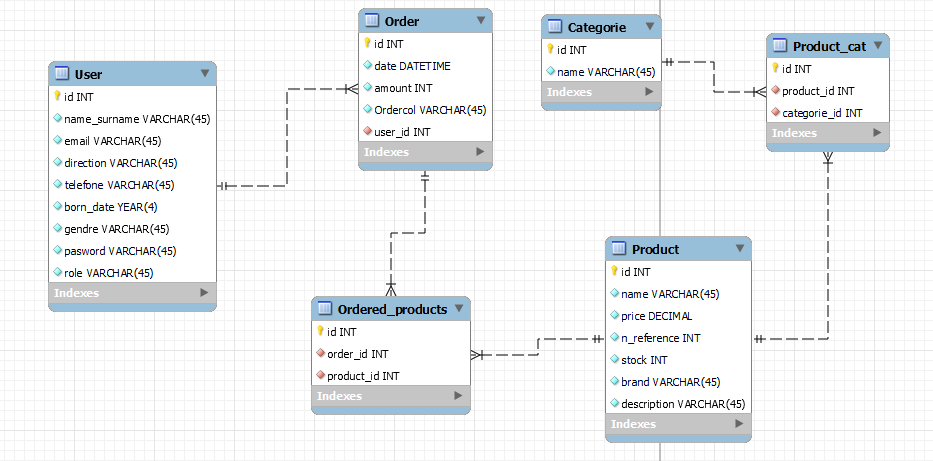

# Projecto Back-End e-commerce

En este proyecto de backend creamos una base de datos para un e-commerce con los conocimientos adquiridos en las tecnologías node y express, además de mysql y sequelize.

## Descripción general

En este proyecto, he creado una API para un e-commerce que permite a los usuarios realizar pedidos. Incluye funcionalidades como registro de usuarios con autenticación, gestión de productos, gestión de categorías, creación de pedidos y más.

Mi proyecto esta impulsado por Node.js, Express, MySQL con Sequelize y otras tecnologías de vanguardia.

## Tecnologías

Nodo.js

Expresar

MySQL con Sequelize

Bcrypt para autenticación de usuario

Fichas web JSON (JWT)

y más...

## Características

Registro de usuario con hash de contraseña segura (Bcrypt).

Inicio de sesión de usuario con autenticación basada en JWT.

Gestión de productos con operaciones CRUD.

Relaciones de muchos a muchos y de uno a muchos entre usuarios, productos, categorías y pedidos.

Verificaciones para la configuración inicial de datos en usuarios y productos.

Gestión por categorías.

Creación y seguimiento de pedidos.

Perfil de usuario con información de pedido y producto.

Cerrar sesión de usuario.

## Endpoints

El proyecto ofrece los siguientes endpoints para diversas funcionalidades, como la gestión de productos, categorías, pedidos y usuarios.

## Instalación

Para comenzar su proyecto de e-commerce, siga estos pasos de instalación:

Clona este repositorio.

Instale las dependencias requeridas usando npm install.

Configure su base de datos MySQL y configure la conexión en el proyecto.

Ejecute la aplicación con npm start.

## Modo de uso

Para utilizar la API tienes que interactuar con ella a través de solicitudes HTTP. Asegúrese de estar autenticado para realizar determinadas acciones, como crear o modificar productos y usuarios.

## Diagrama SQL

